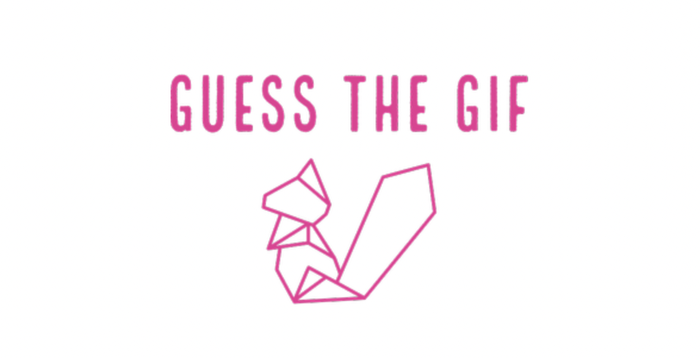
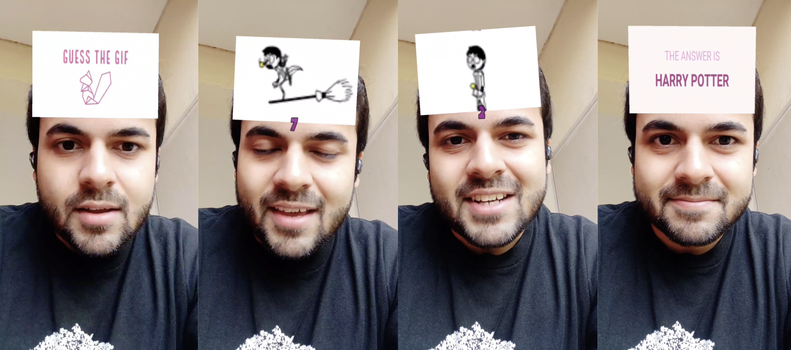
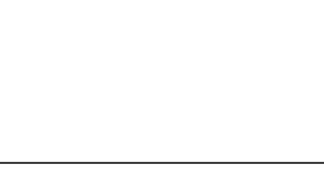
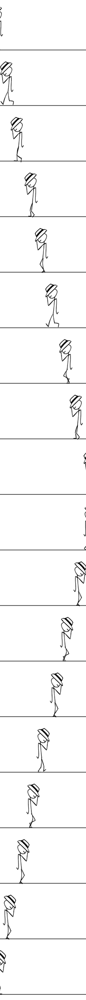
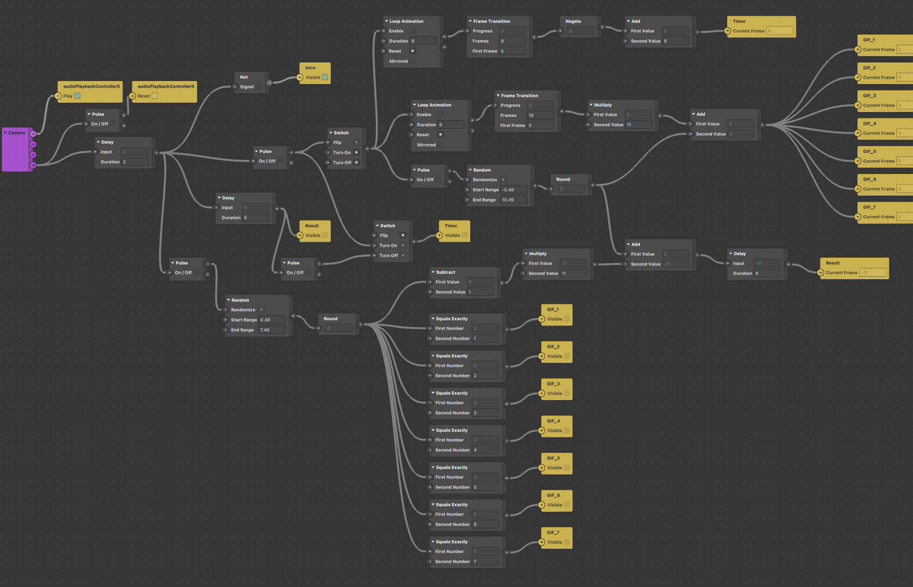

# GuessTheGIF
Inspired by the popular guessing game of the same name developed
by [Random Logic Games, LLC](https://www.randomlogicgames.com/)
and using my previous instagram guessing game filter,
[GuessTheDoodle](https://github.com/kj7kunal/GuessTheDoodle), as base,
**[GuessTheGIF](https://www.facebook.com/sparkarhub/effect/view/660979818219392/)**
is a game that prompts the user to guess the GIF before it finishes playing.

## Try out the Filter

- [Link (opens instagram)](https://www.instagram.com/ar/660979818219392/)
- [Video Demo](https://www.facebook.com/sparkarhub/effect/view/660979818219392/)

## Dev Summary

### Converting GIFs to "Sprite Grids"

Gifs cannot be processed directly in SparkAR. Therefore, in the instagram effect,
we need to process it as a sprite sheet, which is basically the individual frames
of a gif stacked together.

To incorporate multiple such sprite sheets in the filter and selecting one at random,
the sprite sheets are stacked horizontally into a single image, and the correct
gif frame's coordinates can be easily determined using row and column indices.

SparkAR only allows images of maximum 1024 x 1024 pixels, so a few constraints
were placed on the sprite sheet dimensions to ensure that the maximum number
of gifs can be handled by one image. 

- Each frame is resized to 200 x 128, to ensure same size in all sprite sheets
- Number of frames from each gif is chosen to be 18, in a trade-off between
continuity and loss in quality
- Since we need the maximum number of gifs to be handled by each sprite grid,
the final image should be close to a square
- ⌊ 18 * 128 / 200 ⌋ = 11 GIFs were therefore supported by each grid

`/scripts/gtg_gif.py` is a python script used to create sprite sheets and sprite
grids by processing the gifs using `Pillow` library. `/scripts/GIF_Processing.ipynb`
can also be referred to for experimentation.

Here's the generated vertical sprite sheet for a Michael Jackson GIF:

  

    
  

  

    
  

### Creating the filter in SparkAR

Once the resources are ready, this filter does not require any Javascript code to be
written. All the objects and textures can be put together using the UI itself, and
tutorials on how to use SparkAR can easily be found on youtube and the SparkAR community
is very helpful.

As a beginner at using SparkAR, there were a lot of things I learned from the
documentation, as per the need. As mentioned, the project uses sprite sheets to
model animations, and it is advised to keep the
[sprite sheet documentation page](https://sparkar.facebook.com/ar-studio/learn/tutorials/sprite-sheets/#importing-sprite-sheets)
at hand while working on the project.

By modifying the functionality in GuessTheDoodle, GuessTheGIF can now support as many as
77 GIFs by randomizing selection between 7 sprite grids. More grids CAN be added.

The patch editor therefore needs to account for

- 2 transitions (3 phases)
  - Intro Card (logo)
  - Question Card (gif animation) with timer
  - Answer Card (eg. The answer is Michael Jackson)
- Sprite srid Selection
  - Randomized index
- GIF selection (common to all sprite grids)
  - Randomized index
  - Sprite sheet coordinate calculation

The following is the patch editor design able to support 77 different questions:

## Requirements

- SparkAR Studio (need latest version for compatibility with Facebook platforms)
- Python
  - Pillow==8.3.1
